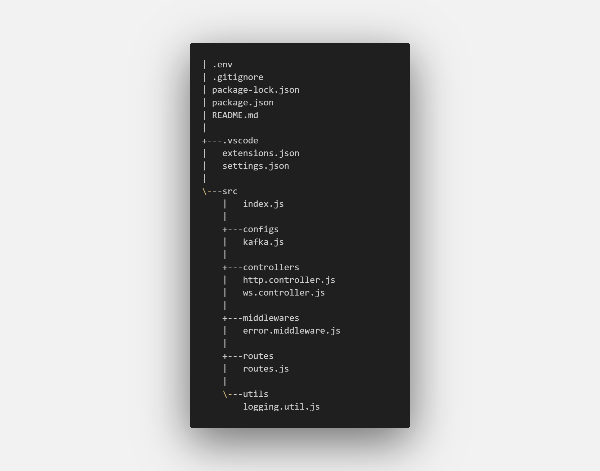

# Chat-Web Backend

This repository contains the backend application for the Chat-Web project. The backend is developed using Node.js and Express.js, with WebSocket communication and Kafka message broker integration.

## Project Structure

## Environment Configuration

The project utilizes a `.env` file for configuration. Make sure to set the required environment variables, such as `PORT`, `KAFKAJS_NO_PARTITIONER_WARNING`, etc.

## Scripts

- `npm start`: Start the server in production mode.
- `npm run dev`: Start the server in development mode using nodemon.
- `npm run debug`: Start the server in debug mode using nodemon.
- `npm test`: Placeholder for running tests.

## Dependencies

- [chalk](https://www.npmjs.com/package/chalk): Terminal string styling.
- [cors](https://www.npmjs.com/package/cors): Enable CORS for Express.js.
- [debug](https://www.npmjs.com/package/debug): Debug utility.
- [dotenv](https://www.npmjs.com/package/dotenv): Load environment variables from a file.
- [express](https://www.npmjs.com/package/express): Web framework for Node.js.
- [kafkajs](https://www.npmjs.com/package/kafkajs): Kafka client for Node.js.
- [ws](https://www.npmjs.com/package/ws): WebSocket library for Node.js.

## Kafka Configuration

The Kafka configuration is stored in `src/configs/kafka.js`. Ensure that the Kafka broker details are correctly set.

## Controllers

- `http.controller.js`: Handles HTTP requests, storing messages to Kafka.
- `ws.controller.js`: Manages WebSocket communication, consumes Kafka messages, and broadcasts to connected clients.

## Middlewares

- `error.middleware.js`: Custom middleware for handling errors.

## Routes

API routes are defined in `src/routes/routes.js`. Current routes include:

- `POST /chat`: Store a message to Kafka.
- `GET /websocket-url`: Retrieve the WebSocket URL.

## WebSocket

WebSocket communication is established in `src/controllers/ws.controller.js`. Messages are consumed from Kafka and broadcasted to connected clients.

## Logging

Logging is implemented using the `debug` utility. Logs can be enabled by setting the `DEBUG` environment variable.

## Getting Started

1. Install dependencies: `npm install`
2. Set up the `.env` file with the required configurations.
3. Start the server: `npm start`

## Contributing

Feel free to contribute to the development of this project by opening issues or pull requests. Your feedback and contributions are highly appreciated!

## License

This project is licensed under the ISC License - see the [LICENSE](LICENSE) file for details.
